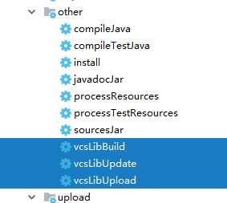

# vcsLib

v2.0版本测试中，改进方向
1. 配置不再放在`build.gradle`中，新建配置文件`vcsLib.conf`
1. 提供一个GUI版本的配置工具
1. vsc仓库的更新操作不再跟随`gradle build`操作（防止SVN目录锁住）
1. 待续...


[ ](https://bintray.com/ningopensource/maven/vcsLib)
[](https://jitpack.io/#NingOpenSource/vcsLib)


用于gradle的vcs库管理，目前支持git以及SVN当作maven仓库

https://www.jianshu.com/p/944bb00355e2

https://github.com/zacker330/jshint-gradle
### How to use?

1. config step 1>>`$rootDir/build.gradle`:
```gradle
        buildscript {
            repositories {
                jcenter()  //required
            }
            dependencies {
                classpath "org.yanning.gradle:vcsLib:+"  //lastest version
            }
        }
```
**or** 
```gradle
        buildscript {
            repositories {
                jcenter()  //required
                maven { url 'https://jitpack.io' }  //required
            }
            dependencies {
                classpath 'com.github.NingOpenSource:vcsLib:+'  //lastest version
            }
        }
```        

2. config step 2>>`$projectDir/build.gradle`:
    
Android:
```gradle
        apply plugin: 'vcsLib_android'
```
Java:    
```gradle
        apply plugin: 'vcsLib'
```
Then: 
```gradle
        vcsLib{
            from{   // add a vcs repository
                vcs "svn://192.168.0.1/android/.vcsLibs", "username", "password" //config svn or git repository
            }
            to{     //config maven, publish java or android library to vcs repository
                groupId "com.github.NingOpenSource"
                artifactId 'LogFormat'
                version "0.0.3"
                vcs "svn://192.168.0.1/android/.vcsLibs", "username", "password" //config svn or git repository
            }
        }
```   
        
3. publish java or android library to vcs repository
    
**CMD**：
```gradle    
        gradle :[module_name]:vcsLibUpload
```
**IDE**：
    

        
4. dependencies
```gradle        
        dependencies {
            compile 'com.github.NingOpenSource:LogFormat:0.0.3'
        }
```

### upload to jcenter:

**CMD**
```gradle    
        gradle clean build install generatePomFileForMavenPublication bintrayUpload -PbintrayUser=[username] -PbintrayKey=[userkey] -PdryRun=false
```        
